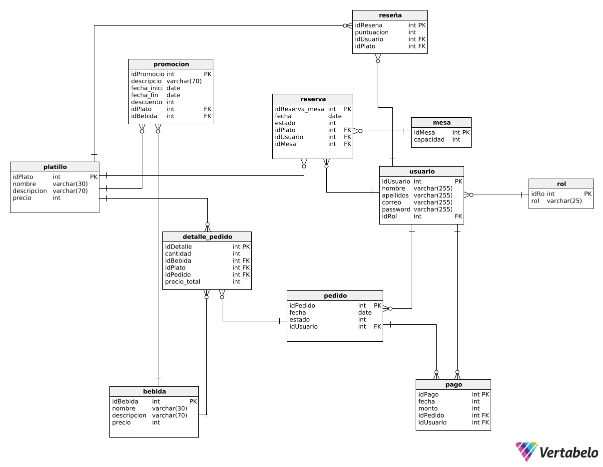

# Sistema Web de Gestión de Pedidos, Reservas, Menú y Promociones para el Restaurante Yummy

## Descripción
Sistema web para mejorar la operación del restaurante **Yummy**, centralizando procesos clave: **reservas**, **pedidos**, **gestión de menú** y **promociones**. Incluye una interfaz web interactiva para uso operativo y administración.

## Equipo de desarrollo
| Nombre              | Rol |
|---------------------|-----|
| Jhulianna Tarqui    | Tech Lead / Backend Developer |
| Dominic Escalante   | Frontend Developer |
| Alejandro Chiri     | Frontend Developer |
| Gabriela Barrios    | QA / Software Quality Analyst |

---

## ✨ Features
- **Reservas:** registro y administración de reservas de mesas.
- **Pedidos:** creación y gestión de pedidos (flujo operativo).
- **Menú:** administración de productos/categorías (CRUD).
- **Promociones:** creación y gestión de promociones (vigencia/reglas básicas).
- **Dashboard / métricas:** visualización de información operativa *(según implementación del proyecto)*.

---

## 🧱 Tech Stack
**Frontend**
- Vue.js
- HTML, CSS, JavaScript

**Backend**
- Node.js
- Express.js (REST API)

**Database**
- PostgreSQL

---

## 🏗️ Architecture / Repo Structure
- `server/` → Backend API (Node.js + Express)
- `yummy/` → Frontend (Vue.js)
---

## 🚀 Getting Started

### Prerequisites
- Node.js (LTS recomendado)
- PostgreSQL
- npm

### 1) Clone
```bash
git clone https://github.com/Jhuly1215/YummyRestaurant.git
cd YummyRestaurant
